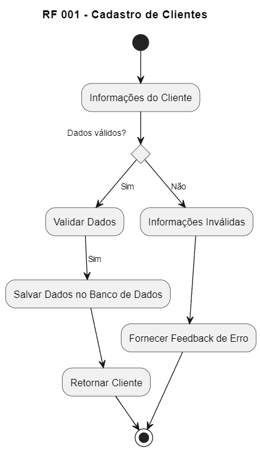

# RF 001 - Cadastro de Clientes

1. Início (*)
2. Verificar se os dados são válidos
   - Sim: Validar Dados -> Salvar Dados no Banco de Dados -> Retornar Cliente -> Retorno para (*)
   - Não: Informações Inválidas -> Fornecer Feedback de Erro -> Retorno para (*)
