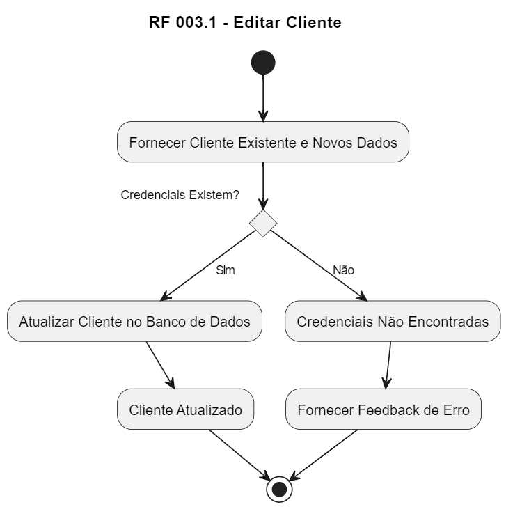

# RF 003.1 - Editar Cliente

1. Início (*)
2. Fornecer Cliente Existente e Novos Dados
3. Verificar se as credenciais existem
   - Sim: Atualizar Cliente no Banco de Dados -> Cliente Atualizado -> Retorno para (*)
   - Não: Credenciais Não Encontradas -> Fornecer Feedback de Erro -> Retorno para (*)
