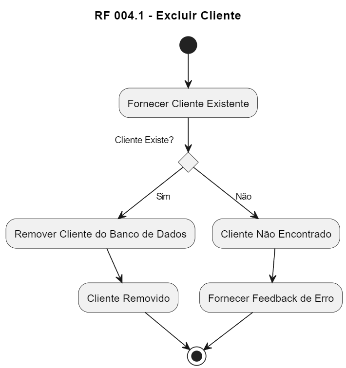

# RF 004.1 - Excluir Cliente

1. Início (*)
2. Fornecer Cliente Existente
3. Verificar se o cliente existe
   - Sim: Remover Cliente do Banco de Dados -> Cliente Removido -> Retorno para (*)
   - Não: Cliente Não Encontrado -> Fornecer Feedback de Erro -> Retorno para (*)
