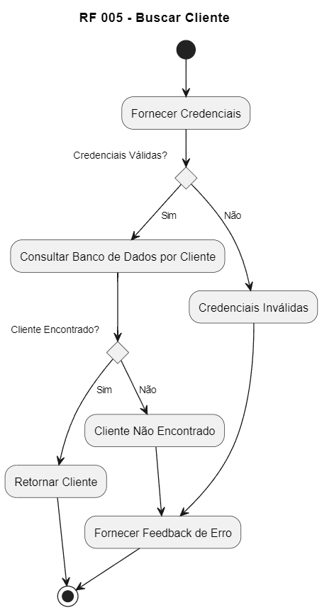

# RF 005 - Buscar Cliente

1. Início (*)
2. Fornecer Credenciais
3. Verificar se as credenciais são válidas
   - Sim: Consultar Banco de Dados por Cliente
     - Cliente Encontrado: Retornar Cliente -> Retorno para (*)
     - Cliente Não Encontrado: Fornecer Feedback de Erro -> Retorno para (*)
   - Não: Credenciais Inválidas -> Fornecer Feedback de Erro -> Retorno para (*)
