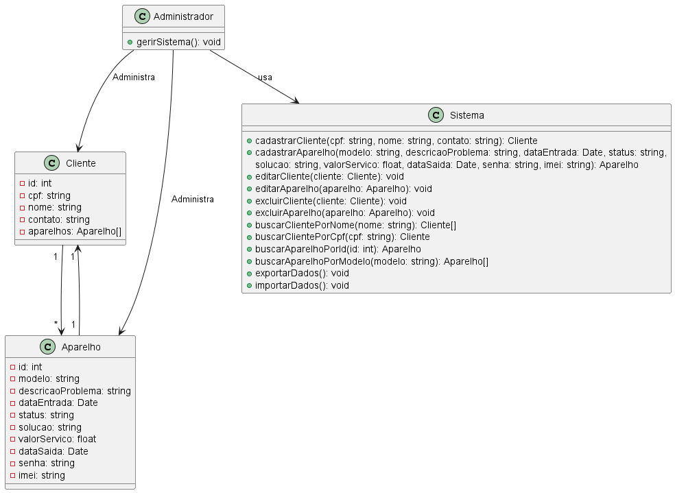
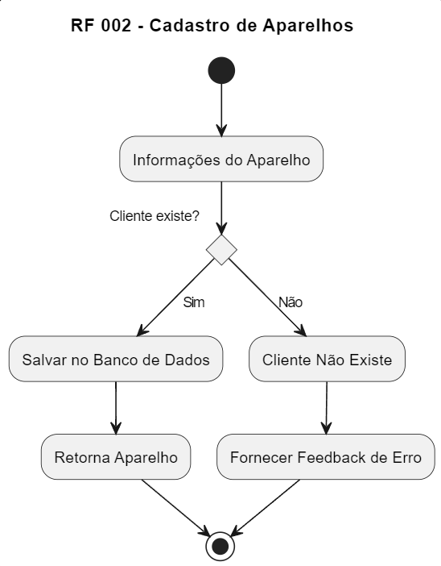
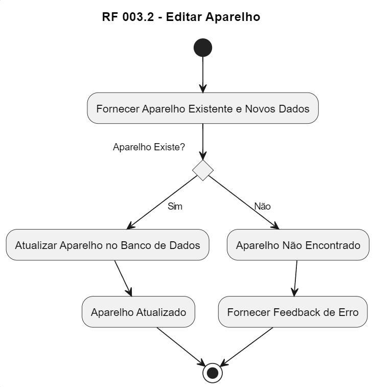
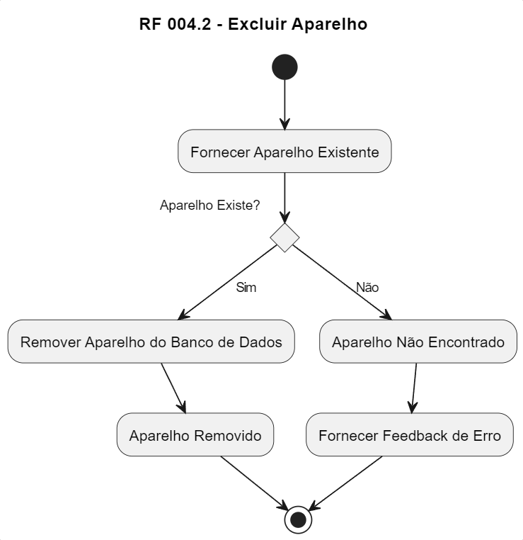
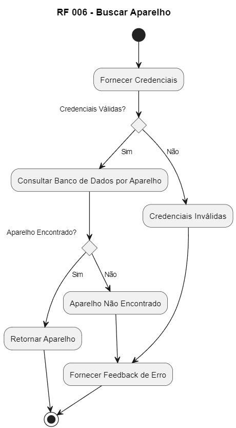

## Diagrama de Classes

Este diagrama de classes descreve a estrutura de um sistema de gerenciamento de clientes e aparelhos, juntamente com as operações que podem ser realizadas no sistema.

- **Cliente:** A classe Cliente representa um cliente do sistema. Ele possui os atributos cpf, nome, contato e aparelhos. O atributo aparelhos é uma lista de objetos do tipo Aparelho, representando os aparelhos associados a esse cliente.

- **Aparelho:** A classe Aparelho representa um dispositivo que pertence a um cliente. Ele possui vários atributos, como id, modelo, descricaoProblema, dataEntrada, status, solucao, valorServico, dataSaida, senha e imei.

- **Relacionamento Cliente-Aparelho:** Há um relacionamento entre Cliente e Aparelho, indicando que um Cliente pode possuir vários Aparelhos (um para muitos). Isso é representado pela seta `"1" --> "*"`, significando que um Cliente possui muitos Aparelhos. Além disso, há outra seta `"1" --> "1"`, que indica que um Aparelho pertence a um único Cliente.

- **Administrador:** Existe para usar os métodos da entidade Sistema. Dessa forma o Admin consegue controlar de forma eficiente as entidades Cliente e Aparelhos.

- **Sistema:** A classe Sistema representa a camada de negócios do sistema. Ela contém vários métodos para operações como cadastrar, editar, excluir e buscar clientes e aparelhos, além de métodos para exportar e importar dados.

## Diagrama de Atividades

### RF 001 - Cadastro de Clientes

1. Início (*)
2. Verificar se os dados são válidos
   - Sim: Validar Dados -> Salvar Dados no Banco de Dados -> Retornar Cliente -> Retorno para (*)
   - Não: Informações Inválidas -> Fornecer Feedback de Erro -> Retorno para (*)

### RF 002 - Cadastro de Aparelhos

1. Início (*)
2. Verificar se o cliente existe
   - Sim: Salvar no Banco de Dados -> Retorna Aparelho -> Retorno para (*)
   - Não: Cliente Não Existe -> Fornecer Feedback de Erro -> Retorno para (*)

### RF 003.1 - Editar Cliente

1. Início (*)
2. Fornecer Cliente Existente e Novos Dados
3. Verificar se as credenciais existem
   - Sim: Atualizar Cliente no Banco de Dados -> Cliente Atualizado -> Retorno para (*)
   - Não: Credenciais Não Encontradas -> Fornecer Feedback de Erro -> Retorno para (*)

### RF 003.2 - Editar Aparelho

1. Início (*)
2. Fornecer Aparelho Existente e Novos Dados
3. Verificar se o aparelho existe
   - Sim: Atualizar Aparelho no Banco de Dados -> Aparelho Atualizado -> Retorno para (*)
   - Não: Aparelho Não Encontrado -> Fornecer Feedback de Erro -> Retorno para (*)

### RF 004.1 - Excluir Cliente

1. Início (*)
2. Fornecer Cliente Existente
3. Verificar se o cliente existe
   - Sim: Remover Cliente do Banco de Dados -> Cliente Removido -> Retorno para (*)
   - Não: Cliente Não Encontrado -> Fornecer Feedback de Erro -> Retorno para (*)

### RF 004.2 - Excluir Aparelho

1. Início (*)
2. Fornecer Aparelho Existente
3. Verificar se o aparelho existe
   - Sim: Remover Aparelho do Banco de Dados -> Aparelho Removido -> Retorno para (*)
   - Não: Aparelho Não Encontrado -> Fornecer Feedback de Erro -> Retorno para (*)

### RF 005 - Buscar Cliente

1. Início (*)
2. Fornecer Credenciais
3. Verificar se as credenciais são válidas
   - Sim: Consultar Banco de Dados por Cliente
     - Cliente Encontrado: Retornar Cliente -> Retorno para (*)
     - Cliente Não Encontrado: Fornecer Feedback de Erro -> Retorno para (*)
   - Não: Credenciais Inválidas -> Fornecer Feedback de Erro -> Retorno para (*)

### RF 006 - Buscar Aparelho

1. Início (*)
2. Fornecer Credenciais
3. Verificar se as credenciais são válidas
   - Sim: Consultar Banco de Dados por Aparelho
     - Aparelho Encontrado: Retornar Aparelho -> Retorno para (*)
     - Aparelho Não Encontrado: Fornecer Feedback de Erro -> Retorno para (*)
   - Não: Credenciais Inválidas -> Fornecer Feedback de Erro -> Retorno para (*)
