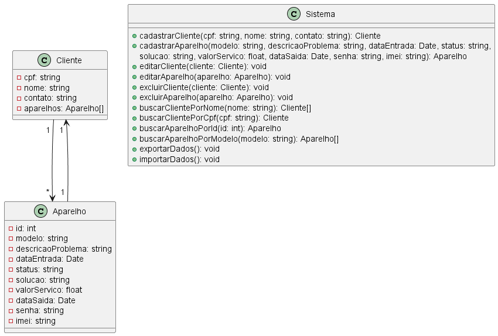

## Diagrama de Classes

Este diagrama de classes descreve a estrutura de um sistema de gerenciamento de clientes e aparelhos, juntamente com as operações que podem ser realizadas no sistema.

- **Cliente:** A classe Cliente representa um cliente do sistema. Ele possui os atributos cpf, nome, contato e aparelhos. O atributo aparelhos é uma lista de objetos do tipo Aparelho, representando os aparelhos associados a esse cliente.

- **Aparelho:** A classe Aparelho representa um dispositivo que pertence a um cliente. Ele possui vários atributos, como id, modelo, descricaoProblema, dataEntrada, status, solucao, valorServico, dataSaida, senha e imei.

- **Relacionamento Cliente-Aparelho:** Há um relacionamento entre Cliente e Aparelho, indicando que um Cliente pode possuir vários Aparelhos (um para muitos). Isso é representado pela seta `"1" --> "*"`, significando que um Cliente possui muitos Aparelhos. Além disso, há outra seta `"1" --> "1"`, que indica que um Aparelho pertence a um único Cliente.

- **Sistema:** A classe Sistema representa a camada de negócios do sistema. Ela contém vários métodos para operações como cadastrar, editar, excluir e buscar clientes e aparelhos, além de métodos para exportar e importar dados.

## Diagrama de Atividades