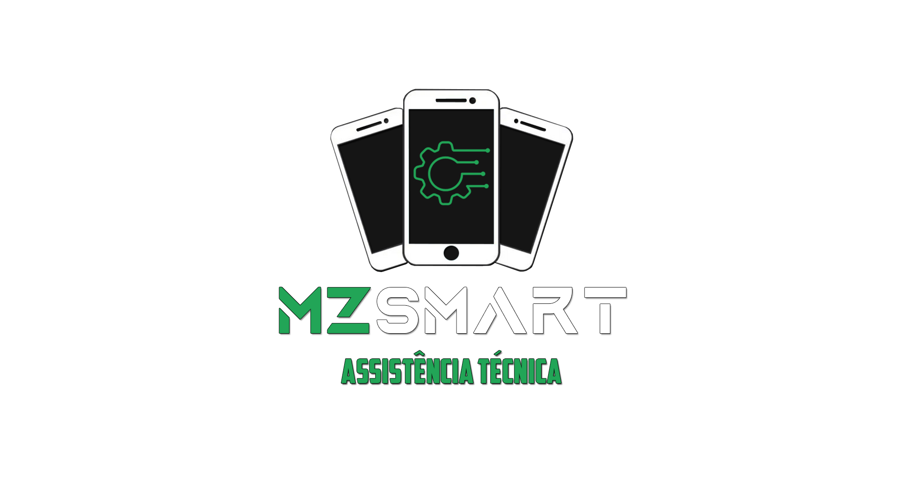

# MZ Smart - Plataforma de Gerenciamento para Assistência Técnica



## 📋 Sumário
- [📖 Sobre o Projeto](#sobre)
- [🌐 Acesso ao Deploy do projeto (Ambiente de desenvolvimento)](#dev)
- [✨ Funcionalidades Principais](#funcionalidades)
- [💻 Tecnologias Utilizadas](#tecnologias)
- [🔧 Requisitos](#requisitos)
- [⚙️ Instalação e Configuração](#config)
- [👥 Histórias de Usuário](#hist)
- [📊 Diagramas](#diagramas)
- [👨‍💻 Equipe de Desenvolvimento](#equipe)
- [📥 Contribuições](#contrib)
- [🤖 Testes unitários(backend)](#testesUnit)
- [📝 Testes sistemicos](#testes)

## 📖 Sobre o Projeto <a id="sobre"></a>
O **MZ Smart** é uma plataforma web desenvolvida para simplificar e organizar o fluxo de trabalho da assistência técnica MZSmart de celulares e tablets etc. O sistema permite o gerenciamento de clientes, dispositivos e pedidos de serviço de maneira eficiente, facilitando a administração diária e a rastreabilidade de informações.

Este projeto foi criado com o intuito de atender às necessidades do nosso cliente, possibilitando a visualização rápida do status de dispositivos e a geração de relatórios detalhados de clientes e aparelhos.

## 🌐 Acesso ao Deploy do projeto (Ambiente de desenvolvimento)<a id="dev"></a>

O projeto está disponível para acesso em ambiente de desenvolvimento através do seguinte link:
<a href="http://206.42.26.185:3002/" target="_blank">http://206.42.26.185:3002/</a>

**OBS:** O deploy não foi realizado em plataformas como Vercel devido ao uso de HTTP em vez de HTTPS, o que gera restrições e solicitações de permissões para o acesso. Por isso, o sistema foi implantado em uma máquina particular.

## ✨ Funcionalidades Principais <a id="funcionalidades"></a>
- ✅ **Cadastro e Gerenciamento de Clientes**: Interface intuitiva para adicionar, editar e visualizar clientes, bem como associar dispositivos aos perfis.
- 📱 **Gerenciamento de Aparelhos**: Cadastro detalhado de dispositivos, com informações como modelo, nome do cliente, descrição do problema, status do aparelho, senha e IMEI
- 🔧 **Status de Reparos**: Atualização em tempo real do progresso dos reparos, facilitando o acompanhamento de cada etapa do processo.
- 📜 **Histórico de Serviços**: Registro de todos os serviços realizados em cada aparelho, proporcionando maior controle e histórico de atendimentos.
- 💻 **Interface Responsiva**: Design que se adapta a diferentes tamanhos de tela, permitindo o uso em desktops, tablets e celulares.

## 💻 Tecnologias Utilizadas <a id="tecnologias"></a>
O projeto utiliza uma combinação de tecnologias modernas para garantir desempenho, escalabilidade e uma experiência de usuário fluida.

- **Frontend**:

  
  
  

- **Backend**:

  
  
  
  

- **Outras Tecnologias**:

  
  
  
## 🔧 Requisitos <a id="requisitos"></a>
Para rodar o projeto localmente, é necessário ter os seguintes pré-requisitos instalados:

- Node.js v14.0 ou superior
- MongoDB
- npm (gerenciador de pacotes do Node.js)

Veja mais sobre os requisitos detalhados [aqui](./Documentation/requirements.md).

## ⚙️ Instalação e Configuração <a id="config"></a>
Para rodar o projeto localmente, siga os passos abaixo:

1. Clone o repositório para sua máquina:
   ```bash
   git clone https://github.com/seu-usuario/mzsmart.git
   cd mzsmart
   ```

2. Instale as dependências do projeto:
   ```bash
   npm install
   ```

3. Configure as variáveis de ambiente (arquivo `.env`):
   ```bash
   PORT=3000
   DB_CONNECTION=mongodb://localhost:27017/mzsmart
   JWT_SECRET=sua-chave-secreta
   ```

4. Inicie o servidor:
   ```bash
   npm start
   ```

O servidor estará rodando em [http://localhost:3000](http://localhost:3000).

## 👥 Histórias de Usuário <a id="hist"></a>

As histórias de usuário detalham as principais funcionalidades do sistema para técnicos.

- **Cadastro de Clientes:** Registrar novos clientes com campos obrigatórios (CPF, nome).
- **Cadastro de Aparelhos:** Adicionar aparelhos para manutenção com informações essenciais (modelo, problema).
- **Edição de Clientes/Aparelhos:** Editar informações já cadastradas para mantê-las atualizadas.
- **Busca de Clientes/Aparelhos:** Pesquisar clientes por CPF/nome e aparelhos por modelo/ID.
- **Exclusão de Registros:** Remover registros de clientes e aparelhos que não são mais necessários.
- **Agendamento de Atendimentos:** Agendar horários de atendimento para melhor organização.
- **Histórico de Atendimento:** Visualizar um histórico detalhado de atendimentos.

Confira a lista completa de histórias de usuário [aqui](./Documentation/userStories.md).


## 📊 Diagramas <a id="diagramas"></a>

Os **diagramas de classe** e **diagramas de atividade** foram criados para ilustrar a arquitetura e o fluxo do sistema de gerenciamento de clientes e aparelhos.

# Diagrama de classes:
 Representa as principais entidades do sistema: Cliente, Aparelho, e Sistema. Cada classe foi implementada com seus atributos e métodos, destacando o relacionamento 1 para muitos entre clientes e aparelhos. A classe Sistema centraliza operações como cadastro, edição, exclusão, e busca, garantindo a modularidade e escalabilidade do sistema.
Diagrama de Atividades

# Diagramas de atividades:
Detalham os fluxos dos principais requisitos funcionais (RFs), como cadastro, edição, exclusão e busca de clientes e aparelhos. Cada fluxo foi implementado conforme o diagrama, assegurando a validação de dados, interação com o banco de dados e feedback ao usuário.

Veja os diagramas [aqui](./Documentation/Diagrams/diagrams.md).

## 🤖 Testes Unitários(backend) <a id="testesUnit"></a>

Implementamos 25 testes unitários para garantir a robustez e o funcionamento correto do backend. Estes testes cobrem todas as rotas principais e funcionalidades do sistema, incluindo operações de criação, leitura, atualização e exclusão.
Abordagem dos Testes

Cobertura Completa: Testamos rotas e funcionalidades para clientes e aparelhos.

Framework: Utilizamos Jest para uma execução eficiente e relatórios detalhados.

Mocking e Spying: Isolamos a lógica de teste usando mocks e spies para evitar
dependências externas.

Casos de Erro: Incluímos verificações para garantir que o sistema lida corretamente com exceções e erros.

**OBS:** Os arquivos dos testes são os que possuem a extensão **".spec.ts"**, por exemplo: **"devices.controllers.spec.ts"**

Veja a implementação dos testes de cliente [aqui](./backend/src/devices/) e dos testes de aparelhos [aqui](./backend/src/users/).

## 📝 Testes Sistemicos <a id="testes"></a>

Os testes sistêmicos da aplicação foram feitas de forma manual, eles garantem que todos os módulos e funcionalidades da aplicação estejam funcionando de forma integrada e correta. Esses testes simulam o uso real do sistema, verificando desde o cadastro de clientes e aparelhos até a busca, edição, exclusão de dados, e outras funcionalidades críticas. O objetivo é identificar possíveis falhas ou incompatibilidades entre os componentes, assegurando uma experiência estável e confiável para o usuário.

Veja a planilha de testes [aqui](./Documentation/Testes%20sistemicos.pdf).

## 👨‍💻 Equipe de Desenvolvimento <a id="equipe"></a>

O **MZ Smart** foi desenvolvido pela seguinte equipe:

- **Guilherme dos Santos Cavalcante** - 510831
- **Jorge Bruno Costa Alves** - 509718
- **Gabriel Ileis Araujo Vieira** - 493973

Cada integrante contribuiu para diferentes aspectos do projeto, incluindo desenvolvimento frontend, backend, e integração com banco de dados.

## 📥 Contribuições <a id="contrib"></a>

Contribuições são bem-vindas! Se você deseja colaborar com o projeto, siga as etapas abaixo:

1. Faça um fork do projeto
2. Crie uma nova branch:
   ```bash
   git checkout -b feature/nova-funcionalidade
   ```
3. Commit suas mudanças:
   ```bash
   git commit -m 'Adiciona nova funcionalidade'
   ```
4. Envie para o repositório:
   ```bash
   git push origin feature/nova-funcionalidade
   ```
5. Abra um Pull Request no GitHub.

